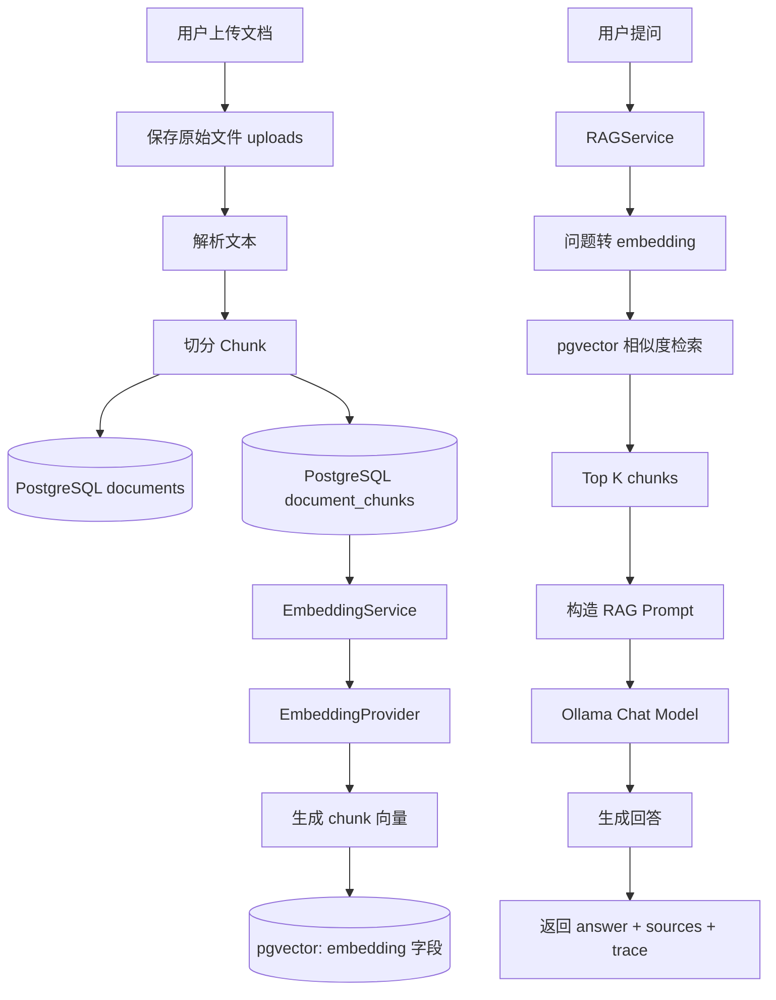
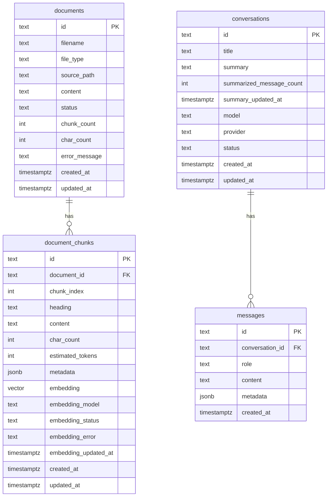

# 第七周教程：数据库化 RAG 检索 + RAG 问答

本教程基于你当前项目真实代码状态设计，不是凭空写。

我看到的关键现状：

1. 第六周教程本身明确：Week 6 主线是 `document_chunks.json -> PostgreSQL -> embedding -> pgvector -> search-debug`，并且当时还保留了从 JSON 同步到 PostgreSQL 的过渡方案。
2. 当前 `document_store.py` 仍然在用 `documents.json`、`document_chunks.json` 做文档和 chunk 存储。
3. 当前 `conversation_store.py` 仍然在用 `conversations.json`、`messages.json` 做会话和消息存储。
4. 当前 `history.py` 仍然在用本地 JSON 保存 `/chat` 的历史记录。
5. Week 6 已经有 PostgreSQL 连接配置、pgvector 依赖、`document_chunks` 表、embedding 状态字段和 HNSW 索引。
6. 当前 `EmbeddingService` 仍然会先 `load_document_chunks()`，再调用 `sync_chunks_from_json()`，说明数据库还不是唯一数据源。
7. 总计划里 Week 7 的目标是：问题 embedding、向量检索 top_k、构造 context、模型回答、返回 sources。

所以第七周不能直接只做 `/rag/ask`。这一周真正的主线应该是：

```text
先彻底抛弃本地 JSON
  ↓
让 PostgreSQL 成为唯一事实来源
  ↓
再实现 RAG Search
  ↓
最后实现 RAG Ask
```

---

# 0. 第七周最终目标

第七周结束后，你的项目要从：

```text
文档上传
  ↓
保存 JSON
  ↓
同步到 PostgreSQL
  ↓
Embedding
  ↓
search-debug
```

升级为：

```text
文档上传
  ↓
直接写入 PostgreSQL
  ↓
Chunk 直接写入 PostgreSQL
  ↓
Embedding 直接读取 PostgreSQL pending chunks
  ↓
pgvector 相似度检索
  ↓
RAG Search
  ↓
RAG Ask
  ↓
返回 answer + sources + trace
```

本周做：

```text
数据库建模
JSON 存储迁移到 PostgreSQL
Document / Chunk 数据库化
Conversation / Message 数据库化
Legacy Chat History 数据库化
RAG Search
RAG Ask
Sources 返回
No Answer Policy
Trace 调试信息
```

本周不做：

```text
Query Rewrite
多轮增强 RAG
Reranker
Agent
MCP
复杂前端
PDF OCR
Celery 异步任务
LangChain 全家桶
```

---

# 1. 第七周整体心智模型

你先把 RAG 系统理解成一个“开卷考试系统”。

```text
用户提问
  ↓
系统不能直接让大模型瞎答
  ↓
先把问题变成向量
  ↓
去数据库里找语义最接近的 chunks
  ↓
把 chunks 拼成资料
  ↓
把资料 + 用户问题 一起交给大模型
  ↓
大模型必须基于资料回答
  ↓
返回答案，并告诉用户依据来自哪些 chunks
```

完整工程流程如下：



你要记住这一句话：

```text
Embedding 负责“找资料”，Chat Model 负责“基于资料组织答案”。
```

---

# 2. 第七周最重要的架构变化

## 2.1 Week 6 的临时方案

第六周允许这样做：

```text
document_chunks.json
  ↓
sync_chunks_from_json()
  ↓
PostgreSQL document_chunks
  ↓
embedding
```

这是合理的过渡方案，因为 Week 6 只解决“chunk 向量化”。

## 2.2 Week 7 必须改掉

第七周要改成：

```text
文档上传时
  ↓
documents 直接 INSERT 数据库
  ↓
document_chunks 直接 INSERT 数据库
  ↓
后续所有查询都从数据库读
```

也就是说：

```text
JSON 不再是数据源
PostgreSQL 才是数据源
```

## 2.3 但上传文件本身可以继续保存在本地

这里要分清楚：

| 类型                     |         是否继续保留本地文件 |
| ---------------------- | -----------------: |
| 原始上传文件 `.md/.txt`      | 可以暂时保留在 `uploads/` |
| `documents.json`       |               不再使用 |
| `document_chunks.json` |               不再使用 |
| `conversations.json`   |               不再使用 |
| `messages.json`        |               不再使用 |
| `chat_history.json`    |               不再使用 |

为什么原始上传文件可以保留？

因为原始文件属于“二进制/文本文件资源”，不是结构化业务数据。真实生产中会放到：

```text
本地磁盘
对象存储 OSS/S3
文件服务器
```

而文档元数据、chunk、embedding、会话、消息，应该进入数据库。

---

# 3. 数据库基础：你先建立正确心智

你现在是数据库小白，所以不要先背 SQL。先理解这些概念。

## 3.1 数据库是什么

数据库不是“一个更高级的 JSON 文件”。

数据库的核心价值是：

```text
结构化存储
快速查询
事务一致性
并发安全
索引加速
关系约束
数据可恢复
```

JSON 文件适合：

```text
临时 demo
本地小样例
配置文件
简单调试
```

数据库适合：

```text
真实业务数据
多人同时访问
按条件查询
分页
排序
关联查询
状态流转
长期保存
```

## 3.2 表是什么

表可以理解成 Excel 的 Sheet。

例如 `documents` 表：

| id    | filename   | status    | chunk_count | created_at |
| ----- | ---------- | --------- | ----------: | ---------- |
| doc-1 | fastapi.md | completed |          12 | 2026-05-18 |
| doc-2 | rag.md     | completed |          20 | 2026-05-18 |

但是数据库表比 Excel 严格：

```text
每一列有类型
可以设置不能为空
可以设置主键
可以设置外键
可以设置默认值
可以设置索引
```

## 3.3 行是什么

一行就是一条业务记录。

```text
documents 表的一行 = 一个文档
document_chunks 表的一行 = 一个 chunk
conversations 表的一行 = 一个会话
messages 表的一行 = 一条消息
```

## 3.4 主键是什么

主键就是一条记录的唯一身份。

例如：

```sql
id TEXT PRIMARY KEY
```

意思是：

```text
id 不能重复
id 不能为空
可以用 id 精确找到这一条记录
```

你的项目现在 Python 里基本都用字符串 UUID，所以第七周建议继续用：

```sql
id TEXT PRIMARY KEY
```

这样改动最小。

后面更正式时可以升级成：

```sql
id UUID PRIMARY KEY
```

## 3.5 外键是什么

外键表示两个表之间的关系。

例如：

```text
一个 document 有多个 document_chunks
```

数据库里可以这样表达：

```sql
document_id TEXT NOT NULL REFERENCES documents(id)
```

意思是：

```text
document_chunks.document_id 必须指向 documents 表里真实存在的 id
```

这样可以防止脏数据：

```text
不允许出现“chunk 存在，但它所属的 document 不存在”的情况
```

## 3.6 索引是什么

索引可以理解成书的目录。

如果没有索引，数据库查数据可能要从第一行扫到最后一行。

例如你经常会这样查：

```sql
SELECT *
FROM document_chunks
WHERE document_id = 'xxx'
ORDER BY chunk_index ASC;
```

所以应该给 `document_id` 建索引：

```sql
CREATE INDEX idx_document_chunks_document_id
ON document_chunks (document_id);
```

## 3.7 事务是什么

事务就是：

```text
要么全部成功
要么全部失败
```

比如上传文档时：

```text
1. 插入 documents
2. 插入 20 个 chunks
3. 更新 documents.chunk_count
```

这三步应该是一个整体。

如果第 2 步插到一半失败，不能留下半成品。

所以数据库操作最后需要：

```python
conn.commit()
```

如果中间异常，连接上下文通常会回滚，避免脏数据。

## 3.8 cursor 是什么

`cursor` 可以理解成“数据库操作员”。

你通过它执行 SQL：

```python
with conn.cursor() as cur:
    cur.execute("SELECT * FROM documents")
    rows = cur.fetchall()
```

你可以类比前端：

```text
axios 是你发 HTTP 请求的工具
cursor 是你发 SQL 请求的工具
```

---

# 4. 第七周的数据建模思想

数据建模不要从“我要建哪些字段”开始。

要从这 5 个问题开始：

```text
1. 业务里有哪些核心对象？
2. 谁和谁是一对多关系？
3. 哪些字段是状态？
4. 未来最常用的查询是什么？
5. 哪些数据需要追踪来源？
```

## 4.1 本项目核心对象

当前第七周至少有这些对象：

```text
Document
DocumentChunk
Conversation
Message
ChatHistory
```

RAG 结果 `Source` 暂时不用建表，因为它是每次检索动态产生的结果。

## 4.2 关系图



---

# 5. 第七周数据库表设计

建议把 `sql/init.sql` 升级成下面这个版本。

## 5.1 完整 `sql/init.sql`

```sql
CREATE EXTENSION IF NOT EXISTS vector;

CREATE TABLE IF NOT EXISTS documents (
    id TEXT PRIMARY KEY,
    filename TEXT NOT NULL,
    file_type TEXT NOT NULL,
    source_path TEXT NOT NULL,
    content TEXT NOT NULL,
    status TEXT NOT NULL DEFAULT 'pending',
    chunk_count INTEGER NOT NULL DEFAULT 0,
    char_count INTEGER NOT NULL DEFAULT 0,
    error_message TEXT,
    created_at TIMESTAMPTZ NOT NULL DEFAULT NOW(),
    updated_at TIMESTAMPTZ NOT NULL DEFAULT NOW()
);

CREATE TABLE IF NOT EXISTS document_chunks (
    id TEXT PRIMARY KEY,
    document_id TEXT NOT NULL REFERENCES documents(id) ON DELETE CASCADE,
    chunk_index INTEGER NOT NULL,
    heading TEXT,
    content TEXT NOT NULL,
    char_count INTEGER NOT NULL,
    estimated_tokens INTEGER NOT NULL,
    metadata JSONB NOT NULL DEFAULT '{}'::jsonb,

    embedding vector(384),
    embedding_model TEXT,
    embedding_status TEXT NOT NULL DEFAULT 'pending',
    embedding_error TEXT,
    embedding_updated_at TIMESTAMPTZ,

    created_at TIMESTAMPTZ NOT NULL DEFAULT NOW(),
    updated_at TIMESTAMPTZ NOT NULL DEFAULT NOW(),

    UNIQUE (document_id, chunk_index)
);

CREATE TABLE IF NOT EXISTS conversations (
    id TEXT PRIMARY KEY,
    title TEXT NOT NULL,
    summary TEXT,
    summarized_message_count INTEGER NOT NULL DEFAULT 0,
    summary_updated_at TIMESTAMPTZ,
    model TEXT NOT NULL,
    provider TEXT NOT NULL DEFAULT 'ollama',
    status TEXT NOT NULL DEFAULT 'active',
    created_at TIMESTAMPTZ NOT NULL DEFAULT NOW(),
    updated_at TIMESTAMPTZ NOT NULL DEFAULT NOW()
);

CREATE TABLE IF NOT EXISTS messages (
    id TEXT PRIMARY KEY,
    conversation_id TEXT NOT NULL REFERENCES conversations(id) ON DELETE CASCADE,
    role TEXT NOT NULL,
    content TEXT NOT NULL,
    metadata JSONB NOT NULL DEFAULT '{}'::jsonb,
    created_at TIMESTAMPTZ NOT NULL DEFAULT NOW()
);

CREATE TABLE IF NOT EXISTS chat_history (
    id TEXT PRIMARY KEY,
    timestamp TIMESTAMPTZ NOT NULL DEFAULT NOW(),
    model TEXT NOT NULL,
    user_input TEXT NOT NULL,
    prompt TEXT NOT NULL,
    answer TEXT NOT NULL,
    elapsed_seconds DOUBLE PRECISION NOT NULL,
    created_at TIMESTAMPTZ NOT NULL DEFAULT NOW()
);

CREATE INDEX IF NOT EXISTS idx_documents_updated_at
ON documents (updated_at DESC);

CREATE INDEX IF NOT EXISTS idx_document_chunks_document_id
ON document_chunks (document_id);

CREATE INDEX IF NOT EXISTS idx_document_chunks_embedding_status
ON document_chunks (embedding_status);

CREATE INDEX IF NOT EXISTS idx_document_chunks_embedding_hnsw
ON document_chunks
USING hnsw (embedding vector_cosine_ops);

CREATE INDEX IF NOT EXISTS idx_conversations_updated_at
ON conversations (updated_at DESC);

CREATE INDEX IF NOT EXISTS idx_messages_conversation_id_created_at
ON messages (conversation_id, created_at ASC);

CREATE INDEX IF NOT EXISTS idx_chat_history_created_at
ON chat_history (created_at ASC);
```

## 5.2 为什么 `documents` 和 `document_chunks` 要分表？

不要把所有 chunks 都塞进 `documents` 的一个 JSON 字段里。

错误设计：

```text
documents
  id
  filename
  chunks: [{...}, {...}, {...}]
```

这样的问题是：

```text
无法高效按 document_id 查询 chunks
无法给 chunk 单独建 embedding 索引
无法单独更新某个 chunk 的 embedding_status
无法给 chunk 做相似度检索
```

正确设计：

```text
documents 一张表
document_chunks 一张表
```

关系：

```text
documents.id = document_chunks.document_id
```

---

# 6. 第七周 API 设计思想

API 设计不要从“函数名”开始，要从“资源”和“动作”开始。

## 6.1 当前已有 API

你的 `routes.py` 当前已经有：

```text
POST /documents/upload
GET /documents
GET /documents/{document_id}
GET /documents/{document_id}/chunks
DELETE /documents/{document_id}

POST /documents/{document_id}/embed
POST /documents/embed-all
GET /documents/{document_id}/embedding-status
POST /embeddings/search-debug
```

这些接口在现有集中式 `routes.py` 中管理。

第七周继续保持集中式路由即可，不要急着拆分路由文件。

## 6.2 新增 RAG API

第七周新增：

```http
POST /rag/search
POST /rag/ask
```

为什么要分两个？

| API           | 作用                     | 是否调用大模型 |
| ------------- | ---------------------- | ------: |
| `/rag/search` | 只检索 chunks             |       否 |
| `/rag/ask`    | 检索 + 组织 prompt + 调模型回答 |       是 |

这两个接口必须分开。

原因：

```text
/rag/search 方便调试检索质量
/rag/ask 负责最终问答
```

如果你发现 `/rag/ask` 回答不好，可以先用 `/rag/search` 判断：

```text
是检索没召回正确资料？
还是召回正确资料但模型回答差？
```

这就是工程调试思维。

---

# 7. 第七周目录设计

基于你当前项目结构，建议最小改动如下：

```text
src/app/
  document_store.py              # 改成 PostgreSQL 实现，保留函数名
  conversation_store.py          # 改成 PostgreSQL 实现，保留函数名
  history.py                     # 改成 PostgreSQL 实现，保留函数名

  services/
    vector_store.py              # 删除 sync_chunks_from_json，增加 score_threshold 和 filename
    embedding_service.py         # 删除 load_document_chunks 依赖
    rag/
      __init__.py
      retriever.py
      prompt_builder.py
      rag_service.py

  schemas.py                     # 增加 RagSearch / RagAsk schema
  api/
    routes.py                    # 增加 /rag/search 和 /rag/ask
```

为什么先不拆 `schemas.py` 和 `routes.py`？

因为第六周教程已经选择继续使用集中式 `routes.py` 和集中式 `schemas.py`，这样对你当前学习阶段更稳定。等 Week 9 或 Week 10 再做模块化拆分更合适。

---

# 8. Day 1：升级数据库结构

## 8.1 执行 SQL

如果你本机数据库是学习环境，可以直接重建：

```bash
psql -U wangzilong -d ai_backend -f sql/init.sql
```

如果你遇到已有表结构冲突，学习阶段可以先清空重来：

```sql
DROP TABLE IF EXISTS chat_history;
DROP TABLE IF EXISTS messages;
DROP TABLE IF EXISTS conversations;
DROP TABLE IF EXISTS document_chunks;
DROP TABLE IF EXISTS documents;
```

然后重新执行：

```bash
psql -U wangzilong -d ai_backend -f sql/init.sql
```

## 8.2 检查表是否创建成功

```sql
\dt
```

预期看到：

```text
documents
document_chunks
conversations
messages
chat_history
```

## 8.3 检查 pgvector

```sql
SELECT * FROM pg_extension WHERE extname = 'vector';
```

能查到说明 pgvector 扩展启用成功。

---

# 9. Day 2：把 `document_store.py` 改成数据库实现

当前 `document_store.py` 的问题是：

```text
它的函数名可以保留
但内部不能再读写 JSON
```

你的 `DocumentService` 当前依赖这些函数：

```python
create_document
create_document_chunks
delete_document
delete_document_chunks
get_document
list_document_chunks
list_documents
update_document
```

所以最小改动策略是：

```text
不改 DocumentService 的调用方式
只重写 document_store.py 的内部实现
```

## 9.1 新版 `document_store.py` 核心实现

```python
import json
import uuid
from datetime import datetime
from typing import Any

from psycopg import sql

from src.app.db import get_connection
from src.app.exceptions import AppError


ALLOWED_DOCUMENT_UPDATE_FIELDS = {
    "filename",
    "file_type",
    "source_path",
    "content",
    "status",
    "chunk_count",
    "char_count",
    "error_message",
}


def _row_to_dict(row: dict[str, Any] | None) -> dict[str, Any] | None:
    if row is None:
        return None

    result = dict(row)

    for key in ["created_at", "updated_at"]:
        if isinstance(result.get(key), datetime):
            result[key] = result[key].isoformat()

    return result


def create_document(
    filename: str,
    file_type: str,
    source_path: str,
    content: str,
    status: str = "pending",
    error_message: str | None = None,
) -> dict[str, Any]:
    document_id = str(uuid.uuid4())

    with get_connection() as conn:
        with conn.cursor() as cur:
            cur.execute(
                """
                INSERT INTO documents (
                    id,
                    filename,
                    file_type,
                    source_path,
                    content,
                    status,
                    chunk_count,
                    char_count,
                    error_message,
                    created_at,
                    updated_at
                )
                VALUES (
                    %(id)s,
                    %(filename)s,
                    %(file_type)s,
                    %(source_path)s,
                    %(content)s,
                    %(status)s,
                    0,
                    %(char_count)s,
                    %(error_message)s,
                    NOW(),
                    NOW()
                )
                RETURNING *
                """,
                {
                    "id": document_id,
                    "filename": filename,
                    "file_type": file_type,
                    "source_path": source_path,
                    "content": content,
                    "status": status,
                    "char_count": len(content),
                    "error_message": error_message,
                },
            )
            row = cur.fetchone()

        conn.commit()

    document = _row_to_dict(row)

    if document is None:
        raise AppError(
            code="DOCUMENT_STORE_ERROR",
            message="创建文档失败",
            status_code=500,
        )

    return document


def update_document(
    document_id: str,
    updates: dict[str, Any],
) -> dict[str, Any]:
    if not updates:
        updates = {}

    invalid_fields = set(updates) - ALLOWED_DOCUMENT_UPDATE_FIELDS
    if invalid_fields:
        raise AppError(
            code="DOCUMENT_STORE_ERROR",
            message="文档更新字段非法",
            detail=f"invalid_fields={sorted(invalid_fields)}",
            status_code=500,
        )

    with get_connection() as conn:
        with conn.cursor() as cur:
            if updates:
                set_sql = sql.SQL(", ").join(
                    sql.SQL("{} = {}").format(
                        sql.Identifier(key),
                        sql.Placeholder(key),
                    )
                    for key in updates
                )

                query = sql.SQL(
                    """
                    UPDATE documents
                    SET {set_sql},
                        updated_at = NOW()
                    WHERE id = %(document_id)s
                    RETURNING *
                    """
                ).format(set_sql=set_sql)

                params = {**updates, "document_id": document_id}
            else:
                query = sql.SQL(
                    """
                    UPDATE documents
                    SET updated_at = NOW()
                    WHERE id = %(document_id)s
                    RETURNING *
                    """
                )
                params = {"document_id": document_id}

            cur.execute(query, params)
            row = cur.fetchone()

        conn.commit()

    document = _row_to_dict(row)

    if document is None:
        raise AppError(
            code="DOCUMENT_NOT_FOUND",
            message="文档不存在",
            detail=f"document_id={document_id}",
            status_code=404,
        )

    return document


def get_document(document_id: str) -> dict[str, Any] | None:
    with get_connection() as conn:
        with conn.cursor() as cur:
            cur.execute(
                """
                SELECT *
                FROM documents
                WHERE id = %(document_id)s
                """,
                {"document_id": document_id},
            )
            row = cur.fetchone()

    return _row_to_dict(row)


def list_documents() -> list[dict[str, Any]]:
    with get_connection() as conn:
        with conn.cursor() as cur:
            cur.execute(
                """
                SELECT *
                FROM documents
                ORDER BY updated_at DESC
                """
            )
            rows = cur.fetchall()

    return [_row_to_dict(row) for row in rows if row is not None]


def delete_document(document_id: str) -> None:
    with get_connection() as conn:
        with conn.cursor() as cur:
            cur.execute(
                """
                DELETE FROM documents
                WHERE id = %(document_id)s
                RETURNING id
                """,
                {"document_id": document_id},
            )
            row = cur.fetchone()

        conn.commit()

    if row is None:
        raise AppError(
            code="DOCUMENT_NOT_FOUND",
            message="文档不存在",
            detail=f"document_id={document_id}",
            status_code=404,
        )


def create_document_chunks(
    document_id: str,
    chunks: list[dict[str, Any]],
) -> list[dict[str, Any]]:
    records: list[dict[str, Any]] = []

    with get_connection() as conn:
        with conn.cursor() as cur:
            for index, chunk in enumerate(chunks):
                content = chunk.get("content", "").strip()
                if not content:
                    continue

                chunk_id = str(uuid.uuid4())

                cur.execute(
                    """
                    INSERT INTO document_chunks (
                        id,
                        document_id,
                        chunk_index,
                        heading,
                        content,
                        char_count,
                        estimated_tokens,
                        metadata,
                        embedding_status,
                        created_at,
                        updated_at
                    )
                    VALUES (
                        %(id)s,
                        %(document_id)s,
                        %(chunk_index)s,
                        %(heading)s,
                        %(content)s,
                        %(char_count)s,
                        %(estimated_tokens)s,
                        %(metadata)s::jsonb,
                        'pending',
                        NOW(),
                        NOW()
                    )
                    RETURNING *
                    """,
                    {
                        "id": chunk_id,
                        "document_id": document_id,
                        "chunk_index": index,
                        "heading": chunk.get("heading"),
                        "content": content,
                        "char_count": len(content),
                        "estimated_tokens": int(chunk.get("estimated_tokens") or 0),
                        "metadata": json.dumps(
                            chunk.get("metadata") or {},
                            ensure_ascii=False,
                        ),
                    },
                )

                row = cur.fetchone()
                if row is not None:
                    records.append(_chunk_row_to_dict(row))

        conn.commit()

    return records


def _chunk_row_to_dict(row: dict[str, Any]) -> dict[str, Any]:
    result = dict(row)

    for key in ["created_at", "updated_at", "embedding_updated_at"]:
        if isinstance(result.get(key), datetime):
            result[key] = result[key].isoformat()

    if result.get("metadata") is None:
        result["metadata"] = {}

    return result


def list_document_chunks(document_id: str) -> list[dict[str, Any]]:
    with get_connection() as conn:
        with conn.cursor() as cur:
            cur.execute(
                """
                SELECT *
                FROM document_chunks
                WHERE document_id = %(document_id)s
                ORDER BY chunk_index ASC
                """,
                {"document_id": document_id},
            )
            rows = cur.fetchall()

    return [_chunk_row_to_dict(row) for row in rows]


def delete_document_chunks(document_id: str) -> None:
    with get_connection() as conn:
        with conn.cursor() as cur:
            cur.execute(
                """
                DELETE FROM document_chunks
                WHERE document_id = %(document_id)s
                """,
                {"document_id": document_id},
            )

        conn.commit()
```

## 9.2 这里你要理解的关键点

### 为什么保留函数名？

因为 `DocumentService` 已经写好了。

如果你保留函数名，就可以最小改动：

```text
DocumentService 不用大改
routes.py 不用大改
schemas.py 不用大改
只替换存储层
```

这就是“分层设计”的好处。

### 为什么 `metadata` 要 `json.dumps()`？

PostgreSQL 里的字段是：

```sql
metadata JSONB
```

Python 里是：

```python
dict
```

写入时要转成 JSON 字符串：

```python
json.dumps(metadata, ensure_ascii=False)
```

再通过 SQL：

```sql
%(metadata)s::jsonb
```

告诉 PostgreSQL：

```text
请把这个 JSON 字符串当成 jsonb 存储
```

### 为什么不用 f-string 拼 SQL？

危险示例：

```python
cur.execute(f"SELECT * FROM documents WHERE id = '{document_id}'")
```

如果用户输入恶意内容，可能 SQL 注入。

正确方式：

```python
cur.execute(
    "SELECT * FROM documents WHERE id = %(document_id)s",
    {"document_id": document_id},
)
```

---

# 10. Day 3：把 `conversation_store.py` 改成数据库实现

当前会话系统也还是 JSON。

第七周要改成：

```text
create_conversation -> INSERT conversations
create_message -> INSERT messages
list_messages -> SELECT messages
count_messages -> COUNT(*)
```

## 10.1 新版核心实现

```python
import json
import uuid
from datetime import datetime
from typing import Any

from psycopg import sql

from src.app.config import get_ollama_model
from src.app.db import get_connection
from src.app.exceptions import ConversationError

ALLOWED_MESSAGE_ROLES: set[str] = {"system", "user", "assistant", "tool"}

ALLOWED_CONVERSATION_UPDATE_FIELDS = {
    "title",
    "summary",
    "summarized_message_count",
    "summary_updated_at",
    "model",
    "provider",
    "status",
}


def _normalize_row(row: dict[str, Any] | None) -> dict[str, Any] | None:
    if row is None:
        return None

    result = dict(row)

    for key in ["created_at", "updated_at", "summary_updated_at"]:
        if isinstance(result.get(key), datetime):
            result[key] = result[key].isoformat()

    if result.get("metadata") is None:
        result["metadata"] = {}

    return result


def create_conversation(title: str, model: str | None = None) -> dict[str, Any]:
    conversation_id = str(uuid.uuid4())

    with get_connection() as conn:
        with conn.cursor() as cur:
            cur.execute(
                """
                INSERT INTO conversations (
                    id,
                    title,
                    summary,
                    summarized_message_count,
                    summary_updated_at,
                    model,
                    provider,
                    status,
                    created_at,
                    updated_at
                )
                VALUES (
                    %(id)s,
                    %(title)s,
                    NULL,
                    0,
                    NULL,
                    %(model)s,
                    'ollama',
                    'active',
                    NOW(),
                    NOW()
                )
                RETURNING *
                """,
                {
                    "id": conversation_id,
                    "title": title,
                    "model": model or get_ollama_model(),
                },
            )
            row = cur.fetchone()

        conn.commit()

    conversation = _normalize_row(row)

    if conversation is None:
        raise ConversationError(
            message="创建会话失败",
            status_code=500,
        )

    return conversation


def list_conversations() -> list[dict[str, Any]]:
    with get_connection() as conn:
        with conn.cursor() as cur:
            cur.execute(
                """
                SELECT *
                FROM conversations
                ORDER BY updated_at DESC
                """
            )
            rows = cur.fetchall()

    return [_normalize_row(row) for row in rows if row is not None]


def get_conversation(conversation_id: str) -> dict[str, Any] | None:
    with get_connection() as conn:
        with conn.cursor() as cur:
            cur.execute(
                """
                SELECT *
                FROM conversations
                WHERE id = %(conversation_id)s
                """,
                {"conversation_id": conversation_id},
            )
            row = cur.fetchone()

    return _normalize_row(row)


def update_conversation(
    conversation_id: str,
    updates: dict[str, Any],
) -> dict[str, Any]:
    invalid_fields = set(updates) - ALLOWED_CONVERSATION_UPDATE_FIELDS
    if invalid_fields:
        raise ConversationError(
            message="会话更新字段非法",
            detail=f"invalid_fields={sorted(invalid_fields)}",
            status_code=500,
        )

    with get_connection() as conn:
        with conn.cursor() as cur:
            if updates:
                set_sql = sql.SQL(", ").join(
                    sql.SQL("{} = {}").format(
                        sql.Identifier(key),
                        sql.Placeholder(key),
                    )
                    for key in updates
                )

                query = sql.SQL(
                    """
                    UPDATE conversations
                    SET {set_sql},
                        updated_at = NOW()
                    WHERE id = %(conversation_id)s
                    RETURNING *
                    """
                ).format(set_sql=set_sql)

                params = {**updates, "conversation_id": conversation_id}
            else:
                query = sql.SQL(
                    """
                    UPDATE conversations
                    SET updated_at = NOW()
                    WHERE id = %(conversation_id)s
                    RETURNING *
                    """
                )
                params = {"conversation_id": conversation_id}

            cur.execute(query, params)
            row = cur.fetchone()

        conn.commit()

    conversation = _normalize_row(row)

    if conversation is None:
        raise ConversationError(
            message="会话不存在",
            detail=f"conversation_id={conversation_id}",
            status_code=404,
        )

    return conversation


def create_message(
    conversation_id: str,
    role: str,
    content: str,
    metadata: dict[str, Any] | None = None,
) -> dict[str, Any]:
    if role not in ALLOWED_MESSAGE_ROLES:
        raise ConversationError(
            message="非法消息角色",
            detail=f"role={role}",
            status_code=400,
        )

    message_id = str(uuid.uuid4())

    with get_connection() as conn:
        with conn.cursor() as cur:
            cur.execute(
                """
                INSERT INTO messages (
                    id,
                    conversation_id,
                    role,
                    content,
                    metadata,
                    created_at
                )
                VALUES (
                    %(id)s,
                    %(conversation_id)s,
                    %(role)s,
                    %(content)s,
                    %(metadata)s::jsonb,
                    NOW()
                )
                RETURNING *
                """,
                {
                    "id": message_id,
                    "conversation_id": conversation_id,
                    "role": role,
                    "content": content,
                    "metadata": json.dumps(metadata or {}, ensure_ascii=False),
                },
            )
            row = cur.fetchone()

            cur.execute(
                """
                UPDATE conversations
                SET updated_at = NOW()
                WHERE id = %(conversation_id)s
                """,
                {"conversation_id": conversation_id},
            )

        conn.commit()

    message = _normalize_message(row)

    if message is None:
        raise ConversationError(
            message="创建消息失败",
            status_code=500,
        )

    return message


def _normalize_message(row: dict[str, Any] | None) -> dict[str, Any] | None:
    if row is None:
        return None

    result = dict(row)

    if isinstance(result.get("created_at"), datetime):
        result["created_at"] = result["created_at"].isoformat()

    if result.get("metadata") is None:
        result["metadata"] = {}

    return result


def list_messages(conversation_id: str) -> list[dict[str, Any]]:
    with get_connection() as conn:
        with conn.cursor() as cur:
            cur.execute(
                """
                SELECT *
                FROM messages
                WHERE conversation_id = %(conversation_id)s
                ORDER BY created_at ASC
                """,
                {"conversation_id": conversation_id},
            )
            rows = cur.fetchall()

    return [_normalize_message(row) for row in rows if row is not None]


def list_recent_messages(
    conversation_id: str,
    limit: int = 10,
) -> list[dict[str, Any]]:
    with get_connection() as conn:
        with conn.cursor() as cur:
            cur.execute(
                """
                SELECT *
                FROM messages
                WHERE conversation_id = %(conversation_id)s
                ORDER BY created_at DESC
                LIMIT %(limit)s
                """,
                {
                    "conversation_id": conversation_id,
                    "limit": limit,
                },
            )
            rows = cur.fetchall()

    messages = [_normalize_message(row) for row in rows if row is not None]

    return list(reversed(messages))


def count_messages(conversation_id: str) -> int:
    with get_connection() as conn:
        with conn.cursor() as cur:
            cur.execute(
                """
                SELECT COUNT(*) AS count
                FROM messages
                WHERE conversation_id = %(conversation_id)s
                """,
                {"conversation_id": conversation_id},
            )
            row = cur.fetchone()

    return int(row["count"]) if row else 0
```

---

# 11. Day 4：把 `history.py` 改成数据库实现

`/chat` 是早期单轮聊天接口，它现在通过 `append_history()` 写 JSON。

第七周也要改掉。

## 11.1 新版 `history.py`

```python
import uuid
from datetime import datetime
from typing import Any

from src.app.db import get_connection


def _normalize_history_row(row: dict[str, Any]) -> dict[str, Any]:
    result = dict(row)

    if isinstance(result.get("timestamp"), datetime):
        result["timestamp"] = result["timestamp"].isoformat()

    return {
        "timestamp": result["timestamp"],
        "model": result["model"],
        "user_input": result["user_input"],
        "prompt": result["prompt"],
        "answer": result["answer"],
        "elapsed_seconds": float(result["elapsed_seconds"]),
    }


def load_history() -> list[dict[str, Any]]:
    with get_connection() as conn:
        with conn.cursor() as cur:
            cur.execute(
                """
                SELECT
                    timestamp,
                    model,
                    user_input,
                    prompt,
                    answer,
                    elapsed_seconds
                FROM chat_history
                ORDER BY created_at ASC
                """
            )
            rows = cur.fetchall()

    return [_normalize_history_row(row) for row in rows]


def append_history(record: dict[str, Any]) -> None:
    with get_connection() as conn:
        with conn.cursor() as cur:
            cur.execute(
                """
                INSERT INTO chat_history (
                    id,
                    timestamp,
                    model,
                    user_input,
                    prompt,
                    answer,
                    elapsed_seconds,
                    created_at
                )
                VALUES (
                    %(id)s,
                    %(timestamp)s,
                    %(model)s,
                    %(user_input)s,
                    %(prompt)s,
                    %(answer)s,
                    %(elapsed_seconds)s,
                    NOW()
                )
                """,
                {
                    "id": str(uuid.uuid4()),
                    "timestamp": record.get("timestamp") or datetime.now(),
                    "model": record["model"],
                    "user_input": record["user_input"],
                    "prompt": record["prompt"],
                    "answer": record["answer"],
                    "elapsed_seconds": record["elapsed_seconds"],
                },
            )

        conn.commit()


def clear_history() -> None:
    with get_connection() as conn:
        with conn.cursor() as cur:
            cur.execute("DELETE FROM chat_history")

        conn.commit()
```

---

# 12. Day 5：修改 `EmbeddingService`，移除 JSON 同步

当前问题：

```python
all_chunks = load_document_chunks()
self.vector_store.sync_chunks_from_json(all_chunks)
```

第七周要删除这类逻辑。

## 12.1 修改前心智模型

```text
JSON chunks
  ↓
同步到 DB
  ↓
embedding
```

## 12.2 修改后心智模型

```text
DB chunks
  ↓
查 pending chunks
  ↓
embedding
```

## 12.3 修改 `embedding_service.py`

删除：

```python
from src.app.document_store import load_document_chunks
```

删除 `embed_document()` 里的：

```python
all_chunks = load_document_chunks()
self.vector_store.sync_chunks_from_json(all_chunks)
```

删除 `embed_all_pending()` 里的：

```python
all_chunks = load_document_chunks()
self.vector_store.sync_chunks_from_json(all_chunks)
```

最终逻辑：

```python
def embed_document(self, document_id: str) -> dict[str, Any]:
    chunks = self.vector_store.list_chunks_by_document(document_id)

    if not chunks:
        raise AppError(
            code="DOCUMENT_CHUNKS_NOT_FOUND",
            message="该文档没有可向量化的 chunks",
            detail=f"document_id={document_id}",
            status_code=404,
        )

    return self._embed_chunks(
        chunks=chunks,
        document_id=document_id,
    )


def embed_all_pending(self) -> dict[str, Any]:
    limit = get_embedding_batch_size()
    chunks = self.vector_store.list_pending_chunks(limit=limit)

    result = self._embed_chunks(chunks=chunks)

    return {
        "total_chunks": result["total_chunks"],
        "embedded_chunks": result["embedded_chunks"],
        "failed_chunks": result["failed_chunks"],
        "embedding_model": result["embedding_model"],
        "status": result["status"],
    }
```

这一步完成后，`EmbeddingService` 就不再依赖本地 JSON。

---

# 13. Day 5：升级 `vector_store.py`，支持 RAG 检索

当前 `vector_store.py` 已经有 `search_similar_chunks()`，但第七周要增强：

```text
返回 filename
支持 score_threshold
只返回 completed embedding
```

## 13.1 删除过渡函数

删除：

```python
sync_chunks_from_json()
```

这个函数是 Week 6 临时桥梁，第七周不能再保留为主链路。

## 13.2 新版 `search_similar_chunks`

```python
def search_similar_chunks(
    self,
    query_embedding: list[float],
    top_k: int = 5,
    score_threshold: float = 0.0,
) -> list[dict[str, Any]]:
    with get_connection() as conn:
        self._register_vector(conn)

        with conn.cursor() as cur:
            cur.execute(
                """
                SELECT
                    dc.id AS chunk_id,
                    dc.document_id,
                    d.filename,
                    dc.chunk_index,
                    dc.heading,
                    dc.content,
                    dc.metadata,
                    dc.embedding <=> %(query_embedding)s AS distance,
                    1 - (dc.embedding <=> %(query_embedding)s) AS score
                FROM document_chunks dc
                JOIN documents d ON d.id = dc.document_id
                WHERE dc.embedding IS NOT NULL
                  AND dc.embedding_status = 'completed'
                  AND 1 - (dc.embedding <=> %(query_embedding)s) >= %(score_threshold)s
                ORDER BY dc.embedding <=> %(query_embedding)s
                LIMIT %(top_k)s
                """,
                {
                    "query_embedding": Vector(query_embedding),
                    "top_k": top_k,
                    "score_threshold": score_threshold,
                },
            )
            return [dict(row) for row in cur.fetchall()]
```

## 13.3 为什么要 JOIN documents？

因为 RAG 返回 sources 时不能只返回 chunk id。

用户需要知道：

```text
这个答案来自哪个文档？
哪个标题？
哪个 chunk？
分数是多少？
```

所以检索时要把 `document_chunks` 和 `documents` 连起来：

```sql
JOIN documents d ON d.id = dc.document_id
```

---

# 14. Day 6：新增 RAG Schema

在 `schemas.py` 里增加：

```python
class RagSearchRequest(BaseModel):
    query: str = Field(..., min_length=1, description="用户检索问题")
    top_k: int = Field(default=5, ge=1, le=20)
    score_threshold: float = Field(default=0.3, ge=0.0, le=1.0)


class RagSearchChunkItem(BaseModel):
    chunk_id: str
    document_id: str
    filename: str
    chunk_index: int
    heading: str | None = None
    content: str
    score: float
    distance: float
    metadata: dict[str, Any] = Field(default_factory=dict)


class RagSearchResponse(BaseModel):
    query: str
    embedding_model: str
    top_k: int
    score_threshold: float
    chunks: list[RagSearchChunkItem]


class RagAskRequest(BaseModel):
    question: str = Field(..., min_length=1, description="用户问题")
    top_k: int = Field(default=5, ge=1, le=20)
    score_threshold: float = Field(default=0.3, ge=0.0, le=1.0)
    model: str | None = Field(default=None, description="可选，覆盖本次回答使用的模型")


class RagSourceItem(BaseModel):
    chunk_id: str
    document_id: str
    filename: str
    heading: str | None = None
    chunk_index: int
    score: float


class RagTrace(BaseModel):
    top_k: int
    score_threshold: float
    retrieved_count: int
    embedding_model: str
    chat_model: str
    provider: str
    latency_ms: int


class RagAskResponse(BaseModel):
    question: str
    answer: str
    sources: list[RagSourceItem]
    trace: RagTrace
```

---

# 15. Day 6：新增 RAG Retriever

创建：

```text
src/app/services/rag/retriever.py
```

代码：

```python
from typing import Any

from src.app.config import get_embedding_model
from src.app.services.embedding.sentence_transformer_provider import (
    SentenceTransformerEmbeddingProvider,
)
from src.app.services.vector_store import PgVectorStore


class RagRetriever:
    def __init__(self) -> None:
        self.embedding_provider = SentenceTransformerEmbeddingProvider()
        self.vector_store = PgVectorStore()

    def search(
        self,
        query: str,
        top_k: int = 5,
        score_threshold: float = 0.3,
    ) -> dict[str, Any]:
        query_embedding = self.embedding_provider.embed_text(query)

        chunks = self.vector_store.search_similar_chunks(
            query_embedding=query_embedding,
            top_k=top_k,
            score_threshold=score_threshold,
        )

        return {
            "query": query,
            "embedding_model": get_embedding_model(),
            "top_k": top_k,
            "score_threshold": score_threshold,
            "chunks": [
                {
                    **chunk,
                    "distance": round(float(chunk["distance"]), 4),
                    "score": round(float(chunk["score"]), 4),
                }
                for chunk in chunks
            ],
        }
```

## 15.1 Retriever 是什么？

Retriever 就是“检索器”。

它只负责：

```text
用户问题
  ↓
转 embedding
  ↓
查向量库
  ↓
返回相关 chunks
```

它不负责调用大模型回答。

这叫职责单一。

---

# 16. Day 6：新增 RAG Prompt Builder

创建：

```text
src/app/services/rag/prompt_builder.py
```

代码：

```python
from typing import Any


class RagPromptBuilder:
    def build(
        self,
        question: str,
        chunks: list[dict[str, Any]],
    ) -> list[dict[str, str]]:
        context = self._build_context(chunks)

        system_prompt = """
你是一个企业知识库问答助手。

你必须严格根据【资料】回答用户问题。

规则：
1. 如果资料中有明确答案，请基于资料回答。
2. 如果资料中没有明确答案，请回答：“根据当前知识库资料，无法确定。”
3. 不要编造资料中不存在的内容。
4. 回答要简洁、准确、结构清晰。
5. 如果涉及代码规范或技术方案，尽量给出示例。
6. 使用简体中文。
""".strip()

        user_prompt = f"""
【资料】
{context}

【用户问题】
{question}
""".strip()

        return [
            {
                "role": "system",
                "content": system_prompt,
            },
            {
                "role": "user",
                "content": user_prompt,
            },
        ]

    def _build_context(self, chunks: list[dict[str, Any]]) -> str:
        if not chunks:
            return "无可用资料。"

        parts: list[str] = []

        for index, chunk in enumerate(chunks, start=1):
            filename = chunk.get("filename") or "未知文档"
            heading = chunk.get("heading") or "无标题"
            content = chunk.get("content") or ""

            parts.append(
                f"""
[资料 {index}]
文档：{filename}
标题：{heading}
Chunk ID：{chunk["chunk_id"]}
相关分数：{chunk["score"]}

内容：
{content}
""".strip()
            )

        return "\n\n---\n\n".join(parts)
```

## 16.1 Prompt Builder 的作用

它负责把检索到的 chunks 变成大模型能理解的上下文。

也就是：

```text
chunks
  ↓
格式化资料
  ↓
塞进 prompt
```

不要在 `routes.py` 里拼 prompt。

不要在 `retriever.py` 里拼 prompt。

这叫分层清晰。

---

# 17. Day 6：新增 RAG Service

创建：

```text
src/app/services/rag/rag_service.py
```

代码：

```python
from time import perf_counter
from typing import Any

from src.app.config import get_ollama_model
from src.app.services.llm.ollama_provider import OllamaProvider
from src.app.services.rag.prompt_builder import RagPromptBuilder
from src.app.services.rag.retriever import RagRetriever


NO_ANSWER = "根据当前知识库资料，无法确定。"


class RagService:
    def __init__(self) -> None:
        self.retriever = RagRetriever()
        self.prompt_builder = RagPromptBuilder()
        self.llm_provider = OllamaProvider()

    def search(
        self,
        query: str,
        top_k: int = 5,
        score_threshold: float = 0.3,
    ) -> dict[str, Any]:
        return self.retriever.search(
            query=query,
            top_k=top_k,
            score_threshold=score_threshold,
        )

    def ask(
        self,
        question: str,
        top_k: int = 5,
        score_threshold: float = 0.3,
        model: str | None = None,
    ) -> dict[str, Any]:
        search_result = self.search(
            query=question,
            top_k=top_k,
            score_threshold=score_threshold,
        )

        chunks = search_result["chunks"]
        selected_model = model or get_ollama_model()

        if not chunks:
            return {
                "question": question,
                "answer": NO_ANSWER,
                "sources": [],
                "trace": {
                    "top_k": top_k,
                    "score_threshold": score_threshold,
                    "retrieved_count": 0,
                    "embedding_model": search_result["embedding_model"],
                    "chat_model": selected_model,
                    "provider": "ollama",
                    "latency_ms": 0,
                },
            }

        messages = self.prompt_builder.build(
            question=question,
            chunks=chunks,
        )

        start = perf_counter()
        response = self.llm_provider.chat(
            messages=messages,
            model=selected_model,
        )
        latency_ms = int((perf_counter() - start) * 1000)

        return {
            "question": question,
            "answer": response.content,
            "sources": [
                {
                    "chunk_id": chunk["chunk_id"],
                    "document_id": chunk["document_id"],
                    "filename": chunk["filename"],
                    "heading": chunk.get("heading"),
                    "chunk_index": chunk["chunk_index"],
                    "score": chunk["score"],
                }
                for chunk in chunks
            ],
            "trace": {
                "top_k": top_k,
                "score_threshold": score_threshold,
                "retrieved_count": len(chunks),
                "embedding_model": search_result["embedding_model"],
                "chat_model": response.model,
                "provider": response.provider,
                "latency_ms": latency_ms,
            },
        }
```

## 17.1 为什么要有 No Answer Policy？

RAG 最大的问题不是“答不出来”。

而是：

```text
资料里没有答案，但模型硬编一个答案
```

所以必须有拒答策略：

```text
没有召回 chunks -> 拒答
最高分低于 threshold -> 不进入结果 -> 拒答
资料不支持答案 -> prompt 要求模型拒答
```

第一版先做前两条。

---

# 18. Day 6：接入路由

在 `routes.py` 里引入 schema：

```python
from src.app.schemas import (
    ...
    RagSearchRequest,
    RagSearchResponse,
    RagAskRequest,
    RagAskResponse,
)
```

引入 service：

```python
from src.app.services.rag.rag_service import RagService
```

新增 API：

```python
@router.post("/rag/search", response_model=RagSearchResponse)
def rag_search_api(request: RagSearchRequest) -> RagSearchResponse:
    result = RagService().search(
        query=request.query,
        top_k=request.top_k,
        score_threshold=request.score_threshold,
    )
    return RagSearchResponse(**result)


@router.post("/rag/ask", response_model=RagAskResponse)
def rag_ask_api(request: RagAskRequest) -> RagAskResponse:
    result = RagService().ask(
        question=request.question,
        top_k=request.top_k,
        score_threshold=request.score_threshold,
        model=request.model,
    )
    return RagAskResponse(**result)
```

---

# 19. Day 7：完整测试流程

## 19.1 启动服务

```bash
python -m src.app.main
```

## 19.2 上传测试文档

```bash
cat > /tmp/frontend-style-guide.md <<'EOF'
# 前端研发规范

## React 组件命名

React 组件必须使用 PascalCase 命名。
例如 UserCard、OrderList、ProductDetail。

## Hook 命名

自定义 Hook 必须以 use 开头。
例如 useUserInfo、useRequest、useDocumentList。

## CSS 命名

CSS class 建议使用 kebab-case。
例如 user-card、order-list。
EOF
```

```bash
curl -X POST http://127.0.0.1:8000/documents/upload \
  -F "file=@/tmp/frontend-style-guide.md"
```

预期：

```json
{
  "document_id": "...",
  "filename": "frontend-style-guide.md",
  "file_type": "md",
  "status": "completed",
  "chunk_count": 3,
  "char_count": 200,
  "created_at": "..."
}
```

## 19.3 查看文档

```bash
curl http://127.0.0.1:8000/documents
```

## 19.4 查看 chunks

```bash
curl http://127.0.0.1:8000/documents/{document_id}/chunks
```

## 19.5 执行向量化

```bash
curl -X POST http://127.0.0.1:8000/documents/{document_id}/embed
```

## 19.6 查看 embedding 状态

```bash
curl http://127.0.0.1:8000/documents/{document_id}/embedding-status
```

预期每个 chunk：

```json
{
  "embedding_status": "completed",
  "embedding_model": "sentence-transformers/paraphrase-multilingual-MiniLM-L12-v2"
}
```

## 19.7 测试 RAG Search

```bash
curl -X POST http://127.0.0.1:8000/rag/search \
  -H "Content-Type: application/json" \
  -d '{
    "query": "React 组件应该怎么命名？",
    "top_k": 5,
    "score_threshold": 0.3
  }'
```

预期能召回：

```text
React 组件必须使用 PascalCase 命名
```

## 19.8 测试 RAG Ask

```bash
curl -X POST http://127.0.0.1:8000/rag/ask \
  -H "Content-Type: application/json" \
  -d '{
    "question": "React 组件应该怎么命名？",
    "top_k": 5,
    "score_threshold": 0.3
  }'
```

预期回答：

```text
React 组件应该使用 PascalCase 命名，例如 UserCard、OrderList、ProductDetail。
```

并返回 sources：

```json
{
  "sources": [
    {
      "filename": "frontend-style-guide.md",
      "heading": "React 组件命名",
      "score": 0.82
    }
  ]
}
```

## 19.9 测试拒答

```bash
curl -X POST http://127.0.0.1:8000/rag/ask \
  -H "Content-Type: application/json" \
  -d '{
    "question": "公司年假制度是什么？",
    "top_k": 5,
    "score_threshold": 0.7
  }'
```

如果知识库里没有相关资料，预期：

```text
根据当前知识库资料，无法确定。
```

---

# 20. 第七周必须删除或废弃的东西

代码里不应再出现这些主链路调用：

```python
load_document_chunks()
save_document_chunks()
load_documents()
save_documents()
load_conversations()
save_conversations()
load_messages()
save_messages()
```

但为了兼容已有 import，你可以保留函数名：

```text
create_document
list_documents
create_message
list_messages
```

只是内部必须改成 SQL。

## 检查命令

```bash
grep -R "json" src/app \
  --exclude-dir="__pycache__" \
  --exclude="*.pyc"
```

允许出现：

```text
json.dumps(metadata)
json.dumps(SSE payload)
```

不允许出现：

```text
documents.json
document_chunks.json
conversations.json
messages.json
chat_history.json
```

---

# 21. 第七周验收标准

## 21.1 数据库验收

必须满足：

```text
documents 表有数据
document_chunks 表有数据
document_chunks.embedding 不为空
conversations 表能保存会话
messages 表能保存消息
chat_history 表能保存 /chat 历史
本地 JSON 不再参与业务读写
```

## 21.2 文档链路验收

```text
上传文档
  ↓
documents 插入一条记录
  ↓
document_chunks 插入多条记录
  ↓
documents.chunk_count 更新正确
```

## 21.3 Embedding 链路验收

```text
POST /documents/{document_id}/embed
  ↓
pending chunks 被读取
  ↓
embedding_status = processing
  ↓
生成 embedding
  ↓
embedding_status = completed
```

## 21.4 RAG Search 验收

```text
POST /rag/search
  ↓
返回 chunks
  ↓
每个 chunk 有 score
  ↓
每个 chunk 有 filename
  ↓
支持 top_k
  ↓
支持 score_threshold
```

## 21.5 RAG Ask 验收

```text
POST /rag/ask
  ↓
先检索
  ↓
再构造 prompt
  ↓
再调用 Ollama
  ↓
返回 answer
  ↓
返回 sources
  ↓
返回 trace
  ↓
无资料时拒答
```

---

# 22. 常见问题排查

## 22.1 `relation "documents" does not exist`

说明表没创建。

执行：

```bash
psql -U wangzilong -d ai_backend -f sql/init.sql
```

## 22.2 `type "vector" does not exist`

说明 pgvector 扩展没启用或 PostgreSQL 没安装 pgvector。

检查：

```sql
CREATE EXTENSION IF NOT EXISTS vector;
```

## 22.3 `expected 384 dimensions, not 768`

说明 embedding 模型输出维度和数据库字段不一致。

当前字段：

```sql
embedding vector(384)
```

如果换 768 维模型，就要改表：

```sql
embedding vector(768)
```

但学习阶段建议不要换模型。

## 22.4 `/rag/search` 没结果

按顺序排查：

```text
1. 文档是否上传成功？
2. document_chunks 表是否有数据？
3. 是否执行过 /documents/{document_id}/embed？
4. embedding_status 是否 completed？
5. score_threshold 是否太高？
6. query 是否和文档语义差太远？
```

SQL 检查：

```sql
SELECT
  embedding_status,
  COUNT(*)
FROM document_chunks
GROUP BY embedding_status;
```

## 22.5 RAG 回答胡编

优先检查：

```text
/rag/search 是否召回了正确 chunk
```

如果 search 没召回，问题在检索。

如果 search 召回正确但 answer 胡编，问题在 prompt。

---

# 23. 第七周你要掌握的核心概念

## 23.1 数据库单一事实来源

这句话很重要：

```text
一个系统里，同一类业务数据只能有一个事实来源。
```

错误：

```text
documents.json 有一份
PostgreSQL documents 又有一份
两边靠同步维持一致
```

问题：

```text
数据可能不同步
删除时可能只删了一边
更新时可能忘记同步
排查问题困难
```

正确：

```text
PostgreSQL 是唯一事实来源
```

## 23.2 Repository / Store 层

你的 `document_store.py`、`conversation_store.py` 本质就是 Repository 层。

它负责：

```text
把业务操作转换成 SQL
```

Service 层不应该关心数据到底怎么存。

例如：

```python
DocumentService.upload_document()
```

只关心：

```text
上传
解析
切分
保存
更新状态
```

不应该关心：

```text
数据是 JSON 还是 PostgreSQL
```

## 23.3 RAG 的三层结构

```text
Retriever
  负责找资料

PromptBuilder
  负责把资料变成 prompt

RagService
  负责串联检索和回答
```

不要把这些都塞进一个函数里。

## 23.4 API 的调试分层

```text
/embeddings/search-debug
  用来验证 embedding + pgvector 是否工作

/rag/search
  用来验证 RAG 检索是否工作

/rag/ask
  用来验证最终问答是否工作
```

这是非常重要的工程调试方式。

---

# 24. 第七周完成后的项目能力表达

你可以这样总结第七周成果：

```text
第七周我完成了项目从本地 JSON 存储到 PostgreSQL 的迁移，
让 documents、document_chunks、conversations、messages、chat_history 都进入数据库，
并将 PostgreSQL 作为唯一事实来源。

在此基础上，我基于 pgvector 实现了 RAG Search 和 RAG Ask：
用户问题会先通过 embedding 模型转换成查询向量，
再通过 pgvector 从 document_chunks 中召回 top_k 相关片段，
然后将片段构造成 RAG Prompt 交给 Ollama 生成答案。

最终接口会返回 answer、sources 和 trace，
其中 sources 可以说明答案依据来自哪个文档、哪个 heading、哪个 chunk，
trace 可以用于调试 top_k、score_threshold、模型、耗时等信息。
```

面试时更短的版本：

```text
我实现了一个最小可用的企业知识库 RAG 后端。
系统支持文档上传、文本切分、chunk 向量化、pgvector 语义检索、基于检索结果的问答生成，并返回引用来源。
同时我把早期本地 JSON 存储迁移到了 PostgreSQL，保证数据库是唯一事实来源，避免 JSON 和数据库双写导致的数据一致性问题。
```

---

# 25. 第七周学习节奏建议

```text
Day 1：
  理解数据库建模
  升级 sql/init.sql

Day 2：
  document_store.py 改成 PostgreSQL

Day 3：
  conversation_store.py 和 history.py 改成 PostgreSQL

Day 4：
  删除 EmbeddingService 对 JSON 的依赖
  删除 sync_chunks_from_json 主链路

Day 5：
  增强 vector_store.search_similar_chunks

Day 6：
  新增 RagRetriever、RagPromptBuilder、RagService
  接入 /rag/search 和 /rag/ask

Day 7：
  全链路测试
  删除 JSON 业务依赖
  更新 README / dev-log
  整理面试表达
```

第七周的本质不是“多写两个 RAG 接口”。

它真正训练的是三件事：

```text
1. 数据库建模能力
2. 后端分层设计能力
3. RAG 工程闭环能力
```
